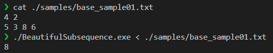
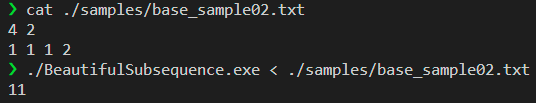
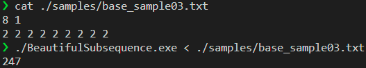
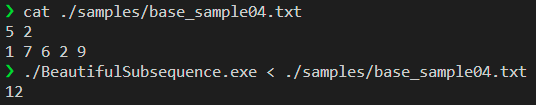
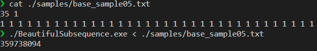
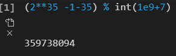
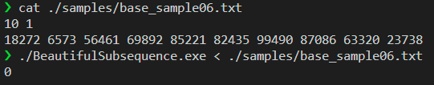

# testing results

#### compile the code

```shell
gcc BeautifulSubsequence.c -o BeautifulSubsequence.exe -lm
```

note that in *nix system, it is necessary to add the tag `-lm`, for we are using `math.h` to calculate the `pow(2,i)`, which should be linked explicitly.

#### testing samples and results

we first present 4 samples to illustrate the correctness of our program

##### same as sample provided



correct

##### test all is possible case



$2^4 -1-4 = 11$ ,answer is correct

##### all possible case2



$2^8 -1-8 = 247$, answer is correct

##### testing general cases



all possible solutions are: 
$$
\begin{cases}
7,6 \ contained:2^3=8\\
only \ 7 \ contained: 2^1 = 2\\
only \ 6 \ contained: 0\\
none \ contained: 2^1 = 2
\end{cases}
$$
therefore the total is 12, answer is correct

##### testing modulo 1e7+9

<table>
    <tr>
        <td><center></center></td>
        <td><center></center></td>
    </tr>
</table>
the answer is correct. 

##### no beautiful subsequence



the answer is correct

#### testing scripts

##### sample generation

```python
# these are only used for random number generation.
# you may use standard lib instead
import numpy as np
import numpy.random as rd
import time
import subprocess
# write sample to a tmp file
def sample_gen(N,diff,filename="test.txt"):
    with open(filename,"w") as f:
        f.write("{} {}\n".format(N,diff))
        NUM_RANGE = int(1e5)
        f.write(" ".join(map(str,rd.randint(1,NUM_RANGE,size=N))))
```

##### run the program

```shell
#!/usr/bin/bash
./BeautifulSubsequence.exe < "$1"
```

##### record the time

```python
def get_time(N,diff,filename="test.txt"):
    sample_gen(N,diff,filename)
    _begin_time = time.time()
    subprocess.run(["./script.sh",filename])
    _end_time = time.time()
    return (_end_time-_begin_time)*1e3  # using ms
```

