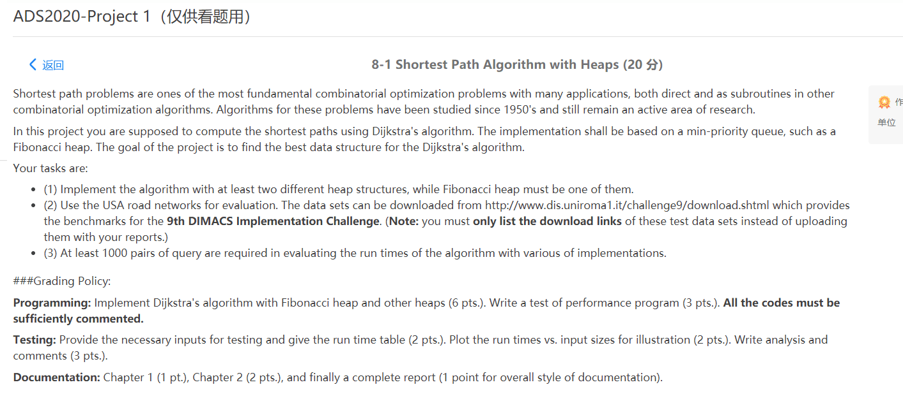
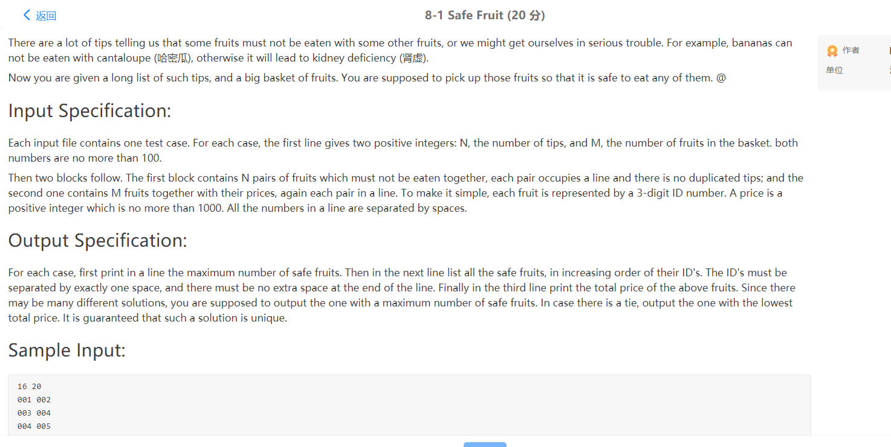
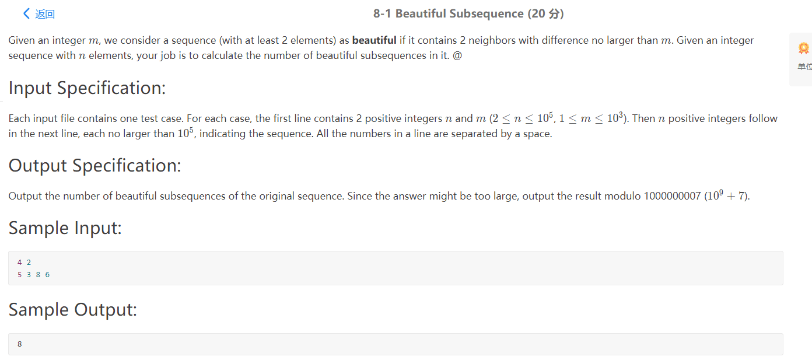
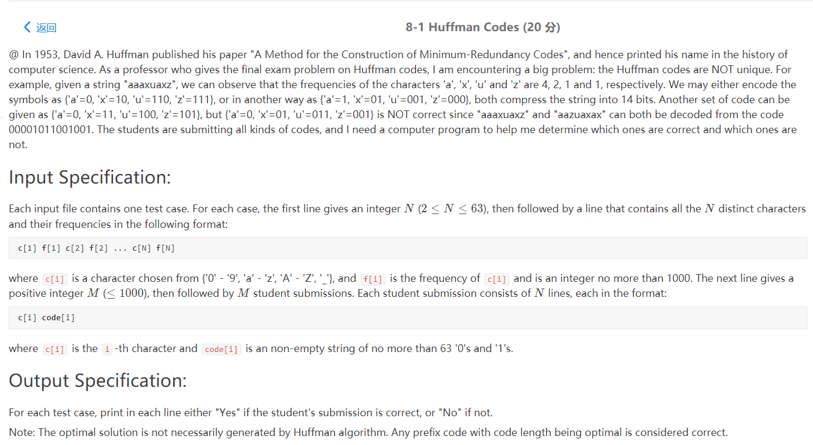
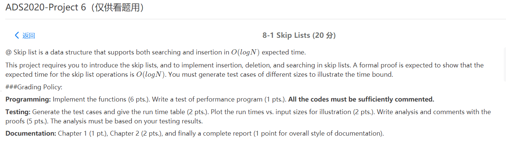
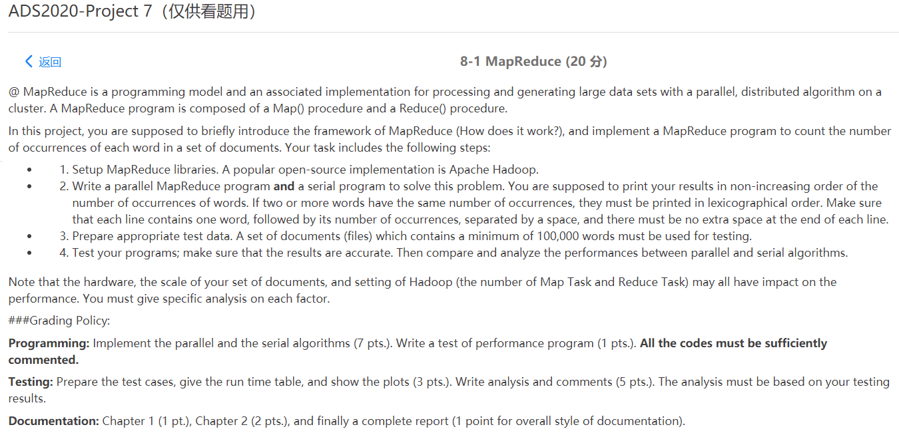

# 合作指南
ZJU ads course project for hjc, zdz,mht.

## 语言选择
项目开始之前明确使用的语言：C/C++，项目内不混用语言

## 接口问题
* 项目开始之前进行充分的讨论，明确具体的计划
* 每个项目都包含一个 README.md，概述整体思路和接口(这个在report中可以复用)
* 讨论当天将头文件写完，确保不会出现接口的问题
* 整合测试的时候需要大家都在场讨论，修改可能的问题

## 测试
尽可能做到自动化，提高测试效率
* 尽量不要使用键盘输入做测试，不利于自动化的测试
* 可以使用 main 的参数 char* argv[] 在命令行做测试 (可以使用命令行管道或者输入输出重定向，非常方便)
* 可以使用文件读入的方式进行测试
测试文件尽可能与项目源文件分开
* 测试用的样例文件和测试代码统一放在 test 文件夹下

## git 使用
* 及时将自己写好的部分 push 到 gitee
* 一般来说在接口规范的情况下，自己模块内部的问题不会造成全局的问题，可以不使用 branch 相关的命令

## 代码规范

## Project 要求
(缺少第7个project，当然这个我们也不会选)

